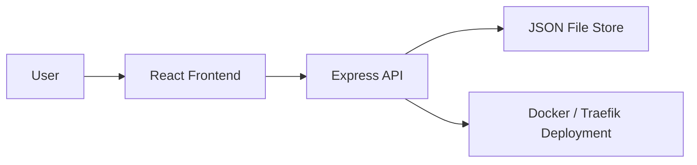
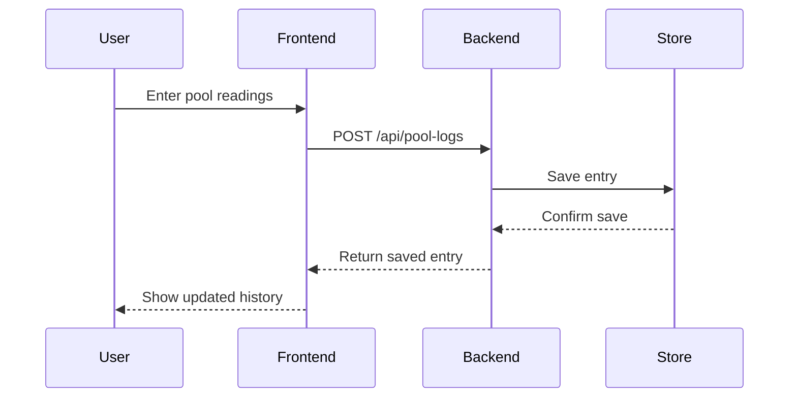

# Architecture Brief

## Purpose & Scope

PoolLog is a lightweight pool chemistry logging application designed to help users quickly record and review water test results such as pH, chlorine, salt, temperature, and total alkalinity. The system focuses on simple daily entry, reliable storage, and a mobile-friendly experience.

## High-Level Architecture

The application is organized as a client-server system:

- A React-based frontend provides the user interface for entering readings and reviewing history.
- An Express backend exposes API endpoints and stores data in a simple file-backed store.
- Optional Docker-based deployment allows the app to run in a containerized environment behind a reverse proxy such as Traefik.

## Core Components

### Frontend
The frontend is a Vite + React + TypeScript application that renders the chemistry form, summary cards, and history view. Its main responsibility is to provide a fast and focused input experience.

### Backend API
The backend exposes REST endpoints for health checks and pool log CRUD operations. It validates incoming data and coordinates persistence.

### Persistence Layer
The persistence layer stores entries in a JSON file on disk. This keeps the architecture simple and lightweight while remaining sufficient for a small personal or small-team application.

### Deployment Layer
The deployment layer packages the frontend and backend into containers and can route traffic through Traefik for reverse proxy support.

## Technology Stack

- Frontend: React, TypeScript, Vite
- Backend: Express.js
- Styling: CSS with a mobile-first UI approach
- Data storage: JSON file-based persistence
- Containerization: Docker, Docker Compose
- Reverse proxy: Traefik (optional)

## Data Flow

1. A user submits pool chemistry details from the frontend form.
2. The frontend sends the data to the backend API.
3. The backend writes the entry to the JSON-backed store.
4. The frontend reloads or refreshes the data from the API to display updated history.

## Key Design Decisions

- A simple client/server split was chosen to support server-backed persistence instead of relying on browser-only storage.
- JSON file storage was selected to keep the backend lightweight and easy to deploy.
- The UI was optimized around quick chemistry entry rather than general-purpose dashboards.
- Docker support was added to make the app easier to host on self-managed infrastructure.

## Scalability & Performance Considerations

The current architecture is well suited to low-to-moderate usage. As demand grows, the following improvements would be appropriate:

- Replace the file store with a database such as SQLite, PostgreSQL, or MongoDB.
- Add authentication and user-specific data isolation if the app expands beyond a single user.
- Introduce caching or rate limiting if traffic increases significantly.
- Separate the frontend and backend more fully for independent scaling.

## Security Considerations

- Use HTTPS in production deployments.
- Restrict API access where appropriate and avoid exposing unnecessary endpoints.
- Validate and sanitize input before saving or processing data.
- Keep container images and dependencies up to date.
- Use environment variables for secrets and deployment-specific configuration.
